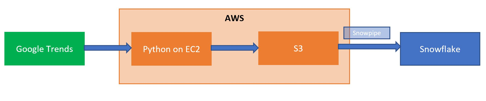

# Pipeline Orchestration on AWS and Snowflake

#### Source
https://trends.google.com/trends/?geo=US

#### Overview
Ingest "inverest over time" and "interest by subregion" data into Snowflake data warehouse. Pipeline executes every hour and ingest incremental data.

#### Architecture Diagram

#### Technology

1. Python scripts scheduled to run every hour on AWS EC2: get hoursly data from Google Trends, and process and save in CSV files in AWS S3
2. S3 buckets send events notification to Snowpipe when receive new files
3. Snowpipe copy data to staging tables
4. Stream from staging tables to data tables
